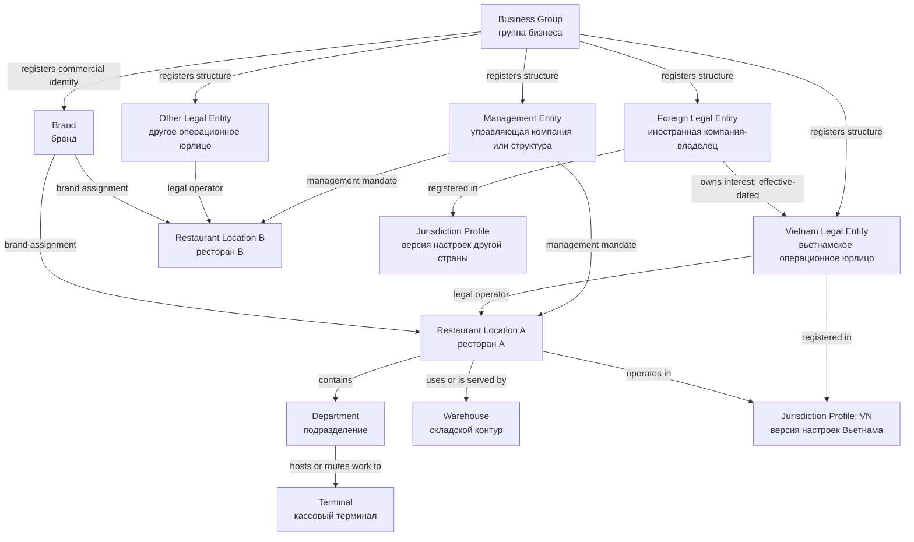
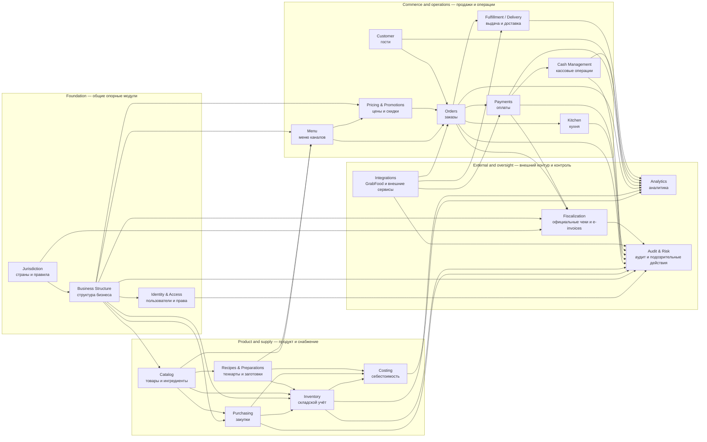

# Block B Analysis: Business Structure, Jurisdiction, and Domain Boundaries

- **Status:** Draft for independent owner/architecture review
- **Date:** 2026-08-09
- **Related issue:** [#11 — Define business structure, jurisdiction and module boundaries](https://github.com/millQ-dev/MillQ/issues/11)
- **Proposed decisions:** [ADR-0004](../decisions/ADR-0004-business-structure-and-jurisdiction.md), [ADR-0005](../decisions/ADR-0005-modular-monolith-domain-boundaries.md)
- **Open Product Owner questions:** [`block-b-product-owner-questions.md`](../product/block-b-product-owner-questions.md)
- **Scope:** Architecture and data ownership only. No business-feature code, schema, migration, API, UI, Block C design, or country-specific fiscal behavior.

## 1. Plain-language summary

MillQ should not represent a restaurant business as one rigid chain such as “owner → company → manager → brand → restaurant”. Real businesses do not always form that tree:

- a foreign company may own a Vietnam company;
- a separate company may manage restaurants belonging to several operating companies;
- one brand may be used by several companies;
- one company may operate several brands and restaurants;
- a central warehouse may serve several locations;
- one user may work across several structures without receiving access merely because a company manages them.

The proposed model therefore separates two things:

1. **Parties and relationships** — companies and the dated links between them: ownership, management, brand control, and legal operation.
2. **Operational structure** — restaurants, departments, warehouses, and terminals where work actually happens.

`Module` (модуль — самостоятельная часть одной программы со своими данными и обязанностями) does not mean a separate service. All modules remain inside one `modular monolith` (модульный монолит — одно развёртываемое приложение, разделённое внутри на строгие части).

`Domain event` (доменное событие — неизменяемая запись о том, что бизнес-факт уже произошёл) is used below to describe information passed between modules. Block B does not select a message broker or asynchronous infrastructure.

## 2. Authority and accepted constraints

This proposal follows:

- `PROJECT_CHARTER.md`: modular monolith, monorepo, clear domain ownership, auditability, transactional integrity, and Vietnam-first localization;
- accepted ADR-0001: TypeScript, React clients, Node.js modular monolith, PostgreSQL, and REST initially;
- accepted ADR-0002: exact money/quantity types, one valuation currency per inventory ledger, and jurisdiction/context rounding policies;
- accepted ADR-0003: warehouse-scoped costing, immutable business chronology, preparation/cost revisions, and no silent rewriting of business facts;
- Product Owner instruction for Block B: multi-company, multi-management, multi-restaurant, and multi-jurisdiction support from day one;
- Operator v2: access scopes by business structure, generic Fiscalization boundary, external adapters, and no microservices.

No source authorizes a Vietnam tax, fiscal, company-law, beneficial-owner, privacy, or accounting rule in this block.

## 3. Research separation

### 3.1 Publicly observed in iiko

Public iiko documentation shows useful restaurant-domain distinctions:

- iikoChain describes a corporation, legal entity, structural subdivision, production unit, trading enterprise, warehouse, central office, and central warehouse. It also states that a warehouse belongs to an operating enterprise or production unit rather than directly to the corporation.
- iikoOffice distinguishes storage places, sales departments such as halls or bars, preparation places such as kitchen or bar, and cash equipment.
- iiko access documentation restricts financial visibility and changes by responsible enterprise/account and permission.
- iiko web documentation treats restaurants in a network as possible internal suppliers when an eligible warehouse is configured.
- iikoFranchise documentation allows different sets of trading enterprises to be connected to different franchises and discusses reporting across currencies.

These sources demonstrate that restaurant operations need several structural levels, location-specific warehouses, and scoped access. They do **not** prove iiko's internal architecture and do not fully model MillQ's required foreign ownership, separate management company, brand licensing, or multi-jurisdiction responsibility.

### 3.2 General restaurant-domain lesson

- Legal ownership, legal seller/operator, operational management, brand presentation, stock custody, and device location are different facts.
- A physical location does not safely identify the legal entity, currency, warehouse, or responsible manager for all time.
- Structure changes must be effective-dated so historical sales and stock remain attributable to the structure that applied when the fact occurred.
- Shared master data and consolidated reporting must not erase legal-entity boundaries.
- Access control must reference business structure but must not be silently granted by an ownership or management relationship.

### 3.3 Proposed MillQ design

- Use an explicit relationship model rather than a single parent column for every concept.
- Keep legal parties and operational nodes separate.
- Require explicit legal-operator, management, brand, jurisdiction, warehouse, and terminal context where relevant.
- Apply country defaults through versioned jurisdiction profiles, never through country checks scattered across common modules.
- Give each module one source of truth and prohibit other modules from writing its data directly.
- Pass commands, queries, and events through explicit in-process contracts inside the modular monolith.

### 3.4 Vietnam-specific implication

- Vietnam is the launch jurisdiction and VND is the onboarding currency default.
- A Vietnam operating legal entity can be owned by a foreign legal entity without making the foreign owner's country settings control the Vietnam restaurant.
- A Vietnam restaurant points to a Vietnam jurisdiction profile and an explicit operating legal entity; shared business logic remains country-neutral.
- Vietnam tax, official receipt, e-invoice, privacy, and company-law behavior remains outside this proposal.

### 3.5 Legal/accounting verification required

Before production use, qualified local review must determine:

- legally required company, branch, establishment, address, registration, and beneficial-owner data;
- whether one location or terminal can sell for more than one legal entity and under what evidence;
- accounting/functional currency and consolidation rules;
- rules for inventory held or moved across legal entities;
- personal-data sharing across legal entities and jurisdictions;
- official receipt/e-invoice responsibility and provider requirements.

### 3.6 Product Owner decision required

The unresolved choices are listed in [`block-b-product-owner-questions.md`](../product/block-b-product-owner-questions.md). The proposed ADRs deliberately do not answer them.

### 3.7 Deferred questions

Block C and later blocks will define document lifecycles, transactions, idempotency, detailed permissions, order/payment workflows, offline synchronization, provider protocols, and concrete implementation tooling.

## 4. Structure principles

1. **No single-company shortcut.** Every legal/financial fact can identify its responsible legal entity.
2. **No strict all-purpose tree.** Containment is used only where it is true; ownership, management, operation, and brand use are separate relationships.
3. **History is effective-dated.** A relationship has a validity interval; editing today's structure does not rewrite yesterday's facts.
4. **Legal and operational identity are separate.** A restaurant is not a legal entity, and a brand is not a restaurant.
5. **Jurisdiction is explicit.** Country-derived defaults are inputs, not hidden global state.
6. **Currency is explicit.** A warehouse inventory ledger never mixes valuation currencies, consistent with ADR-0002 and ADR-0003.
7. **Access is explicit and deny-by-default.** A business relationship is not an access grant.
8. **Stable technical identity is separate from displayed codes and names.** Names and business codes may change without changing the object identity.
9. **Modules own their data.** A module may ask another module to change owned data; it may not update the other module's records directly.
10. **Country/provider logic stays at the edge.** Common order, payment, inventory, and customer logic does not contain GrabFood- or Vietnam-specific branches.

## 5. Proposed business structure

### 5.1 Complete conceptual map

The arrows are named business relationships, not automatic access inheritance and not separate network calls.

### 5.2 Core records

| Record | Plain meaning and responsibility | Data it owns | It does not mean |
| --- | --- | --- | --- |
| `BusinessGroup` | Группа бизнеса: collaboration container for one owner's or operator's managed structure | Stable ID, name, status, registered parties/nodes, group-level settings allowed by policy | A legal person, tax consolidator, or automatic owner of every child |
| `Organization` | Организация: a business actor that may play legal, management, or brand-control roles | Stable identity, names, external references, lifecycle | That every organization is legally registered |
| `LegalEntity` | Юридическое лицо: registered organization responsible for legal and financial facts | Registration jurisdiction reference, legal names/identifiers, status, explicit base settings | A restaurant, brand, warehouse, or user-access grant |
| `ManagementEntity` | Управляющая структура: management profile used in dated mandates | Responsible organization reference, management identity, status | Legal ownership or permission by itself |
| `Brand` | Бренд: commercial identity presented to guests and channels | Brand identity, names, visual/commercial references, controlling-party links | Legal seller, restaurant, catalog item, or access grant |
| `RestaurantLocation` | Ресторан: physical/operational service location | Address reference, operational jurisdiction, status, structural assignments | Legal entity, brand, warehouse, or terminal |
| `Department` | Подразделение: named operating area inside an allowed parent context | Purpose/type, location assignment, status | Stock ledger or cash register by implication |
| `Warehouse` | Склад: stable business-structure scope for stock custody and operations | Identity, location/service assignments, responsible legal entity/currency context references | Inventory balances or movements; those belong to Inventory |
| `Terminal` | Кассовый терминал: stable business endpoint used to attribute POS operations | Identity, restaurant/department assignment, status, allowed operating-context references | Physical device credentials, shift, payment, or fiscal record |
| `JurisdictionProfile` | Профиль юрисдикции: versioned country/region defaults and capability references | Country/subdivision identity, effective version, defaults, approved policy/adapter references | A hardcoded rule inside common business logic |

### 5.3 Relationships are first-class facts

`Effective-dated relationship` (связь с периодом действия) records who was related to what and when. The relationship owns its start/end, status, reason/source, and audit reference.

| Relationship | From → to | Meaning |
| --- | --- | --- |
| `GroupRegistration` | BusinessGroup → party/node | The object is managed or visible in this group context; it does not prove legal ownership |
| `OwnershipInterest` | organization/person kind → LegalEntity | Corporate ownership or control claim; natural-person support and percentage detail require Product Owner/legal decisions |
| `ManagementMandate` | ManagementEntity → RestaurantLocation or approved scope | Who manages operations for the validity period; it grants no system permission automatically |
| `BrandControl` | organization → Brand | Who controls or licenses the brand record |
| `BrandAssignment` | Brand → RestaurantLocation | Which brand a location presents during the validity period |
| `LegalOperatorAssignment` | LegalEntity → RestaurantLocation | Which legal entity is responsible for the location's operation at the relevant business time |
| `DepartmentPlacement` | RestaurantLocation or later-approved parent → Department | Where the department operates |
| `WarehouseServiceAssignment` | Warehouse → RestaurantLocation/Department | Which operations the warehouse serves; stock still stays in the warehouse's own legal/currency ledger |
| `TerminalPlacement` | Terminal → RestaurantLocation/Department | Where the terminal is used |
| `JurisdictionAssignment` | legal/operational node → JurisdictionProfile | Which versioned jurisdiction context applies |

Important cardinalities that lack Product Owner authority remain configurable in the conceptual model and are not silently restricted here.

### 5.4 Example: foreign owner, Vietnam operator, separate manager

1. `BusinessGroup` “Example Hospitality” registers the relevant organizations and operating nodes.
2. Singapore Legal Entity A has an effective-dated `OwnershipInterest` in Vietnam Legal Entity B.
3. Vietnam Legal Entity B is registered under a Vietnam `JurisdictionProfile` and is the `LegalOperator` of Restaurant 1.
4. Management Legal Entity C has a `ManagementMandate` for Restaurant 1 and Restaurant 2, even if Restaurant 2 has another legal operator.
5. Brand X is controlled by an explicit organization and assigned to both restaurants.
6. Restaurant 1 has departments, logical warehouses, and terminals. Every sale and inventory fact still records its actual legal/restaurant/warehouse/terminal context rather than inferring it later from the current structure.

This example proves that foreign ownership, legal operation, management, and branding can change independently without rewriting historical facts.

## 6. Jurisdiction and defaults

### 6.1 Selection points

- Every `LegalEntity` has an explicit registration jurisdiction.
- Every `RestaurantLocation` has an explicit operating jurisdiction.
- A subordinate department, warehouse, or terminal receives a resolved default from its location during creation, while override eligibility is a Product Owner question.
- An owner company's country never silently replaces the operating restaurant's jurisdiction.

### 6.2 Versioned default resolution

When a company or operating structure is created:

1. the user selects a country/jurisdiction;
2. Jurisdiction returns the effective profile version;
3. defaults such as currency, locale, language suggestions, date/number presentation, time-zone choices, and available adapters are shown;
4. the user confirms or changes only fields that policy allows;
5. MillQ stores the resolved values and the source profile version.

A later jurisdiction-profile edit does not silently rewrite already posted financial or inventory facts. Legally significant behavior uses an effective versioned policy reference, consistent with ADR-0002.

### 6.3 Country isolation rule

Common modules may ask Jurisdiction questions such as “which approved rounding policy applies?” or “is a fiscal adapter configured?”. They may not implement scattered conditions such as `if country == "VN"`.

Country packages/adapters may supply:

- approved policy versions;
- validation extensions;
- reference data;
- fiscal/provider capability descriptors;
- localized document/presentation metadata.

Block B defines only the boundary. Vietnam legal/fiscal content requires dedicated research and ADRs.

### 6.4 Currency ownership

- The legal entity and operating location hold explicit currency defaults resolved from jurisdiction.
- Every inventory ledger has one valuation currency; it never mixes currencies.
- A warehouse serving operations of another legal entity cannot make one shared cost stream across entities/currencies. Separate logical ledgers/warehouses are required unless a later accepted design proves another compliant separation.
- Consolidated reporting currency and FX conversion are unresolved and do not alter source ledgers.

## 7. Access-scope targets

`Access scope` (область доступа — конкретная часть бизнеса, в которой разрешение может действовать) is a reference used by Identity & Access. Block B defines the possible targets; Block D defines exact roles, permissions, overrides, inheritance, and evaluation.

Supported target kinds:

- Business Group;
- Legal Entity;
- Management Entity;
- Brand;
- Restaurant Location;
- Department;
- Warehouse;
- Terminal.

Rules fixed at this boundary:

1. Default is deny.
2. Every grant references an explicit target and permission; a title such as “owner” or “manager” is not enough.
3. Ownership, management, brand, and structural relationships do not automatically grant access.
4. A request carries an explicit operating context; the terminal or current restaurant is not trusted as a substitute for authorization.
5. Sensitive actions keep actor and scope context for Audit & Risk.
6. Whether a scope automatically includes current/future descendants is deferred to Block D and Product Owner review.

## 8. Domain-module map

### 8.1 Complete system map

An arrow means “uses an explicit contract or receives data from”, not “writes the other module's tables” and not “requires another service deployment”. Analytics and Audit & Risk consume facts broadly; their arrows are summarized to keep the map readable and detailed in the module table.

### 8.2 Ownership and dependency matrix

| Module | Responsibility | Data it owns | Depends on | May change | Publishes or supplies |
| --- | --- | --- | --- | --- | --- |
| **Identity & Access** | Users, minimal operational employee profiles, memberships/work assignments, roles, grants, and explicit access scopes; detailed policy is Block D and HR/payroll is outside this module | User/account identity, operational employee profile linked to a person where allowed, memberships/work assignments, role/permission definitions, grants, overrides, session/device references later | Business Structure scope IDs; Jurisdiction for locale/security extensions | Only identity/access and minimal operational staff records; never legal-company structure, payroll, orders, or audit evidence | `IdentityChanged`, `EmployeeAssignmentChanged`, `AccessGrantChanged`, authenticated actor context, authorization decisions |
| **Business Structure** | Companies, ownership/management/brand links, restaurants, departments, warehouse and terminal identities | Groups, organizations, legal entities, management profiles, brands, locations, departments, warehouse identities, terminal identities, effective-dated relationships | Jurisdiction profile IDs | Only structure and relationship records; not balances, orders, payments, or permissions | `StructureChanged`, `LegalOperatorChanged`, `ManagementMandateChanged`, `LocationChanged`, scope-target data |
| **Jurisdiction** | Country/region reference data, versioned defaults, approved country policy and adapter registry | Jurisdiction profiles, default sets, policy/capability metadata and effective versions | No restaurant-domain module | Only jurisdiction reference/policy metadata; not company facts after creation | `JurisdictionProfilePublished`, resolved defaults, approved policy references |
| **Catalog** | Canonical purchased products, ingredients, preparations, dishes, modifiers, categories, units/packages reference links | Item identity/type, category, base-unit choice, package/conversion versions owned here unless later split | Business Structure ownership/publication scope; accepted money/UoM rules; Jurisdiction only where approved reference policy applies | Only catalog master data; not recipes, menu publication, price, stock, or cost | `CatalogItemChanged`, `PackageVersionPublished`, stable item data |
| **Recipes & Preparations** | Versioned recipes, preparation specifications, modifier production effects, and effective recipe resolution | Recipe/preparation versions, normative inputs/outputs, materialization mode, technology instructions, resolution results/references | Catalog items/UoM; Business Structure scope | Only normative recipe/preparation data and resolved effective-recipe records; not inventory movements or order lines | `RecipeVersionPublished`, `PreparationSpecificationPublished`, `EffectiveRecipeResolved` |
| **Purchasing** | Suppliers, purchasing intent, supplier agreements, purchase orders, and source receipt documents | Supplier records/relationships, purchasing terms, orders, accepted supplier document facts | Business Structure, Jurisdiction, Catalog, Identity actor context | Only purchasing records; asks Inventory to record stock effect through an explicit contract | `PurchaseOrderChanged`, `GoodsReceiptAccepted`, supplier/document data for Costing and Audit |
| **Inventory** | Inventory ledgers, stock movements, balances, counts, transfers, write-offs, and warehouse-scoped quantity state | Inventory ledger, movement journal, balance projections, stock-operation results; exact document states are Block C | Business Structure warehouse/legal context, Catalog, Purchasing receipt facts, Recipes effective composition, Orders sale facts | Only inventory records; never purchasing/order/recipe source facts | `InventoryMovementRecorded`, `StockBalanceChanged`, movement stream for Costing/Analytics/Risk |
| **Menu** | Channel-facing assortment, names/presentation, availability configuration, and mapping from canonical items to sales channels | Menu versions, sections, channel/location publication, presentation content, availability settings | Catalog, Recipes, Business Structure, Integrations channel capabilities | Only menu publication/presentation; not canonical catalog, price, promotion, or order | `MenuVersionPublished`, `MenuAvailabilityChanged`, channel-ready menu data |
| **Pricing & Promotions** | Versioned prices, discount/surcharge/promotion rules, compatibility and evaluation | Price versions, promotion rules, eligibility/priority definitions, evaluation result identifiers | Menu/catalog references, Business Structure, Jurisdiction rounding/policy, payment-method capability data | Only price/promotion definitions and evaluations; cannot rewrite historical order results | `PricePublished`, `PromotionPublished`, `PricingEvaluated`; Orders stores applied snapshots |
| **Orders** | Commercial order/sale facts, lines, modifiers, channel attribution, totals, and immutable applied-result snapshots | Order identity/state later, order lines, selected modifiers, sales channel, applied price/adjustment snapshot, sale facts | Business Structure, Menu, Pricing, Customer references, Recipes resolution, Integrations input | Only order records; requests inventory, kitchen, payment, fulfillment, and fiscal actions through contracts | `OrderCreated`, `OrderChanged`, `SaleCompleted`, `OrderCancelled`, immutable sale-line data |
| **Kitchen** | Production tickets and kitchen execution status separate from commercial order status | Kitchen ticket/items, routing, priority/course, kitchen states and timestamps | Orders, Recipes, Business Structure departments/production destinations | Only kitchen task state; never order commercial state or recipe versions | `KitchenTicketQueued`, `KitchenItemStarted`, `KitchenItemReady`, `KitchenTicketCompleted` |
| **Payments** | Payment attempts, captured/accepted payments, refunds, tenders, and provider-neutral financial transaction facts | Payment/refund transaction, method/reference, status, order allocation | Orders, Business Structure, Jurisdiction policies, Integrations payment adapters, Identity actor context | Only payment/refund records; never rewrites order, cash shift, or original payment | `PaymentAccepted`, `PaymentFailed`, `RefundRecorded`, settlement data |
| **Cash Management** | Cash drawers, shifts, cash in/out, reconciliation, and cashier operational control | Cash shift/drawer, cash movement, count/reconciliation result | Business Structure terminal/location, Payments cash facts, Identity actor context, Jurisdiction cash policy later | Only cash-operation records; never edits payment or order facts | `CashShiftOpened`, `CashMovementRecorded`, `CashShiftClosed`, discrepancy data |
| **Customer** | Guest identity/profile, contact points, addresses, notes, preferences/consents, and risk markers allowed by policy | Customer profile, contacts, addresses, consents/preferences, merge/link history | Jurisdiction privacy policy later, Business Structure data-sharing scope, Identity actor context | Only reusable customer data; not order history facts owned by Orders | `CustomerChanged`, `ConsentChanged`, customer reference data; receives order links for views |
| **Fulfillment / Delivery** | Dine-in/takeaway handoff and delivery execution, promised/actual timing, dispatch extension | Fulfillment task, delivery address snapshot, status/timestamps, courier assignment later | Orders, Customer address reference, Business Structure, Integrations delivery adapter | Only fulfillment records; not order commercial facts or reusable customer address | `FulfillmentCreated`, `ReadyForHandoff`, `Dispatched`, `Delivered`, `FulfillmentFailed` |
| **Integrations** | Provider adapters, connections, credentials, external identifiers/mappings, inbound/outbound messages and reconciliation | Provider connection/configuration, encrypted secret reference, mapping, external message log and sync state later | Business Structure, Jurisdiction capabilities, and explicit contracts of target modules | Only integration records; translates provider messages and calls owning modules; never writes their tables | `ExternalMessageReceived`, `ExternalMappingChanged`, provider-neutral commands/results; provider events outward |
| **Costing** | Moving-average valuation, issue cost, preparation cost, negative-stock resolution, recalculation revisions | Cost streams/state, valuation results, uncertainty status, resolution delta/unallocated cost records, recalculation revisions | Inventory movements, Purchasing acquisition basis, Recipes/production facts, Business Structure legal/warehouse context, Jurisdiction policy references | Only derived cost data; never changes source movement, receipt, recipe, sale, or payment | `CostCalculated`, `CostRevised`, `CostStatusChanged`, margin inputs for Analytics |
| **Analytics** | Read-only operational and management reporting across preserved dimensions | Derived read models, aggregates, report definitions, refresh/checkpoint metadata | Events/data from all relevant modules; Jurisdiction for presentation/conversion policy | Only derived analytical data; never source business facts | Reports, metrics, anomaly feature data with provenance; no command back to source modules |
| **Audit & Risk** | Immutable action history, sensitive-operation evidence, risk signals/cases, explanations, and review outcomes | Audit entries, correlation links, risk rules/versions later, signals, cases, review disposition | Actor context from Identity, structure context, and facts/events from every sensitive module | Only audit/risk records; may request review/blocking through approved contracts later but never edits source facts | `AuditRecorded`, `RiskSignalRaised`, `RiskCaseChanged`, explainable evidence links |
| **Fiscalization** | Future official receipt/e-invoice request and result boundary, isolated from orders/payments | Fiscal request, provider-neutral fiscal document reference/status, correction link, policy/provider reference | Jurisdiction approved policy, Business Structure legal seller/location, Orders, Payments, Integrations | Only fiscal records; never edits commercial sale/payment facts | `FiscalDocumentRequested`, `FiscalDocumentIssued`, `FiscalDocumentFailed`; official identifiers when approved |

Event names are descriptive contract candidates, not final schemas. Their exact payload, ordering, persistence, and retry behavior belong to Block C/H.

## 9. Cross-module rules

### 9.1 One source of truth

`Source of truth` (источник истины — единственное место, которое имеет право окончательно хранить и менять конкретный факт) is assigned in the matrix above.

Examples:

- Business Structure owns warehouse identity; Inventory owns warehouse balance.
- Catalog owns a dish identity; Recipes owns its composition; Menu owns channel presentation; Pricing owns current rules; Orders owns the historical applied result.
- Orders owns a completed sale; Payments owns payment/refund; Fiscalization owns official-document status.
- Customer owns a reusable address; Fulfillment owns the address snapshot actually used for a delivery.
- Costing owns derived cost revisions; it never rewrites Inventory or Orders.

### 9.2 Allowed communication

- `Command` (команда — запрос владельцу данных выполнить проверяемое изменение) may change data only inside the receiving owner module.
- `Query` (запрос — чтение данных без изменения) reads through an explicit contract or approved read model.
- `Domain event` records a completed fact for downstream work.
- `Projection` (проекция — производная копия данных для чтения или отчёта) may be rebuilt and cannot become a second source of truth.

Direct cross-module table updates are prohibited. A single database and one process are allowed; the boundary is code/data ownership, not network separation.

### 9.3 Transactions without microservices

One application operation may coordinate several modules inside one database transaction when correctness requires it. Each module still validates and writes only its own data. The exact transaction, movement, retry, event-persistence, and recovery model is Block C, so this document does not invent it.

### 9.4 Reference and history rules

- Historical facts keep stable IDs plus required snapshots/version references.
- Renaming a company, brand, restaurant, item, or terminal does not reinterpret a historical order.
- Structure assignments are evaluated at the business fact's effective position, not by today's relationship graph.
- Analytics may join dimensions but never collapse legal entity, warehouse, currency, restaurant, terminal, employee, shift, or sales channel when those dimensions matter.

## 10. Dependency rules

1. Jurisdiction supplies versioned policies/defaults; it does not depend on restaurant transactions.
2. Business Structure owns scope targets and may depend on Jurisdiction, but not on Identity grants.
3. Identity references structure targets; business relationships never imply grants.
4. Catalog, Recipes, Menu, and Pricing form separate layers: canonical item → production definition → channel presentation → commercial rule.
5. Purchasing and Orders create source business facts; Inventory records stock effects; Costing derives value.
6. Kitchen, Payments, Cash Management, and Fulfillment do not own the Order's commercial truth.
7. Integrations translate external protocols and call core contracts; core modules never depend on GrabFood-specific types.
8. Fiscalization is a separate future boundary and cannot be hidden inside Payments or Orders.
9. Analytics and Audit & Risk consume facts but cannot change operational source data.
10. Cyclic code dependencies are prohibited. When two modules need coordination, use an application orchestrator, an explicit neutral contract, or a fact event; exact mechanics are deferred.

## 11. Representative flows without lifecycle invention

These flows show ownership only; they do not define Block C/E state machines.

### 11.1 Company/location onboarding

Jurisdiction supplies a versioned default profile → Business Structure creates explicit company/location configuration → Identity receives scope targets → Audit records the actor and change.

### 11.2 Supplier receipt and cost

Purchasing accepts the supplier fact → Inventory records the authorized warehouse effect → Costing consumes the movement/acquisition basis → Analytics refreshes derived reporting → Audit & Risk receives evidence.

### 11.3 Completed sale

Orders owns the sale and applied commercial snapshots → Recipes supplies the effective composition → Inventory records write-off → Costing derives issue cost → Payments records payment independently → Kitchen and Fulfillment manage their own operational work → Analytics and Audit receive facts.

### 11.4 GrabFood order

Integrations validates/translates provider data → calls Orders through a provider-neutral contract → Orders uses Menu/Pricing snapshots → downstream modules behave as for any other sales channel. GrabFood identifiers and retry state remain in Integrations.

### 11.5 Future official receipt/e-invoice

Orders and Payments provide accepted source facts → Fiscalization applies only an approved jurisdiction/provider policy → Integrations communicates with the provider if required → Fiscalization records the official outcome without rewriting the order or payment.

## 12. Boundaries with later blocks

| Later block | Explicitly not decided here |
| --- | --- |
| Block C | Document numbers/states, posting/reversal mechanics, movement journal schema, transaction boundaries, idempotency, concurrency, recalculation execution, event persistence |
| Block D | Authentication mechanism, exact permission catalog, role inheritance, employee overrides, device/session trust, risk scoring and review workflow |
| Block E | Order/payment/kitchen/customer lifecycles, promotion evaluation detail, cancellation/refund workflow, modifier resolution detail |
| Block F | Offline IDs, queues, synchronization, conflicts, reconnect, terminal device storage |
| Block G | Vietnam localization contents, GrabFood protocol/mapping, privacy research, provider capabilities |
| Block H | Package layout, libraries, framework mechanisms, event/outbox tooling, CI |
| Fiscal session | Vietnam tax, official receipt/e-invoice law, provider/protocol, correction requirements |

## 13. Proposed invariants for owner review

1. MillQ supports multiple legal entities, management entities, brands, restaurants, jurisdictions, warehouses, and terminals inside one business group model.
2. A user identity may participate in multiple business groups; whether a legal entity may be registered in more than one group remains a Product Owner question.
3. Foreign ownership does not change the operating restaurant's jurisdiction or currency by implication.
4. Legal ownership, legal operation, management, brand use, and structural containment are separate effective-dated relationships.
5. BusinessGroup is not treated as a legal person or accounting consolidator by default.
6. Every legal/financial/stock fact carries explicit responsible structure references needed for history.
7. Structure changes do not rewrite historical operational facts.
8. Business relations never grant access automatically; access is explicit and deny-by-default.
9. Country defaults come from versioned jurisdiction profiles; shared business modules contain no country-specific branches.
10. Each inventory ledger has exactly one valuation currency and legal responsibility context.
11. Every data class has one owning module; other modules cannot write it directly.
12. Modules are internal boundaries of one application, not independently deployed services.
13. Integrations and Fiscalization isolate provider/country behavior from core Orders, Payments, Inventory, and Customer logic.
14. Analytics and Audit & Risk do not mutate source business facts.

## 14. Risks

| Risk | Control in this proposal |
| --- | --- |
| Rigid hierarchy cannot represent real ownership/management | Separate parties, operational nodes, and typed effective-dated relationships |
| Current structure rewrites historical reports | Facts retain responsible IDs/snapshots and relationship history |
| Management relationship leaks access | Business relations and access grants are separate; deny by default |
| Country logic spreads through core | Jurisdiction policies/capabilities and adapters are isolated |
| One warehouse mixes companies/currencies | Explicit legal/currency ledger boundary; no mixed moving average |
| Shared data creates hidden legal/privacy leakage | Sharing scope is explicit and unresolved choices are escalated |
| Modules become pseudo-microservices | One deployment/database is allowed; boundaries are ownership/contracts |
| Shared database enables accidental writes | Owner-only write rule and future schema/package enforcement |
| Event names imply premature infrastructure | Events are conceptual completed facts; transport/persistence deferred |
| Fiscal behavior is invented | Fiscalization stays generic until dedicated verified research and ADR |

## 15. Validation plan

Before acceptance:

1. Independent architecture review of both Proposed ADRs and this analysis.
2. Product Owner answers or explicitly defers the questions in the separate question list.
3. Trace the foreign-owner/Vietnam-operator/separate-manager/two-restaurant example through the model.
4. Verify every required module has one responsibility, owned data, dependencies, allowed writes, and outbound data/events.
5. Verify every owned data class has exactly one source-of-truth module.
6. Verify dependency diagrams contain all required modules and no module is presented as a separate service.
7. Verify accepted ADR-0002/0003 currency, warehouse, cost, and history invariants are not contradicted.
8. Verify no Block C lifecycle, schema, migration, application code, Vietnam fiscal rule, or GrabFood protocol was introduced.
9. Validate local Markdown links and Mermaid syntax.

## 16. Sources

Accessed 2026-08-09.

### iiko public sources

- [iikoChain 5.4 user guide: corporation, legal entity, structural subdivision, trading enterprise, production, warehouse, central office/warehouse](https://ru.iiko.help/resources/Storage/archive/PDF/RU_iikoChain_5.4.pdf)
- [iikoOffice 7.7 user guide: restaurant warehouses, sales departments, cash equipment, and production places](https://ru.iiko.help/resources/Storage/archive/PDF/RU_iikoOffice_7.7.pdf)
- [iiko: restricting financial access in a corporation](https://ru.iiko.help/article/how-to-iiko/ogranicheniye-dostupa-k-finansovoy-informatsii)
- [iiko web: suppliers and restaurants as internal suppliers through warehouses](https://ru.iiko.help/article/iikoweb/suppliers)
- [iikoFranchise setup: separate enterprise sets/franchises and multi-currency reporting setup](https://ru.iiko.help/article/special-iiko/topic-3)

These are evidence of public product behavior only. MillQ does not copy or infer iiko's internal implementation.
